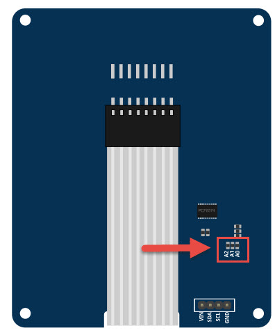

# I2C KEYPAD
I2C Keypad คือ โมดูลที่นำเอา Keypad มาเชื่อมต่อกับ IC PCF8574 ซึ่งเป็น IC สำหรับขยาย Port Digital Input/Output โดยสั่งงานผ่านทาง I2C ทำให้การเชื่อมต่อ
ระหว่าง Microcontroller กับ Keypad ใช้ขา Digital I/O ลดน้อยลง และสะดวกในการใช้งานมากขึ้น เหมาะสำหรับ Microcontroller ที่มี IO น้อยและ ลดการเชื่อมต่อสาย
## ภาพการเชื่อมต่อ I2C Keypad กับ Arduino 

## ภาพการเชื่อมต่อ I2C Keypad กับ ESPion32

## I2C Address
- โดย Default Address ของ I2C KEYPAD คือ 0x20
- สามารถเปลี่ยน Address ได้จากการบัคกรีเอา R ที่ A0,A1,A2 ที่ด้านหลังของบอร์ดออก 

- ตารางการตั้งค่า Address  

